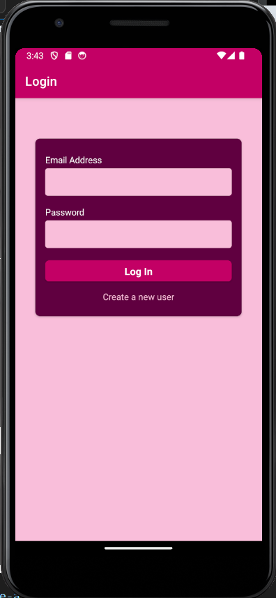
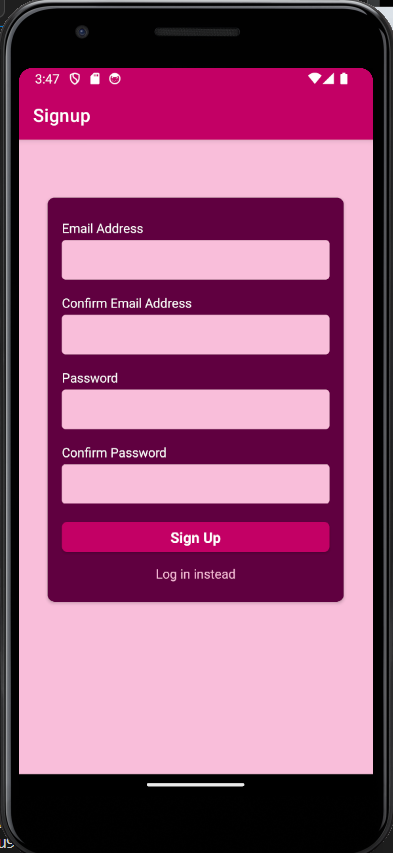
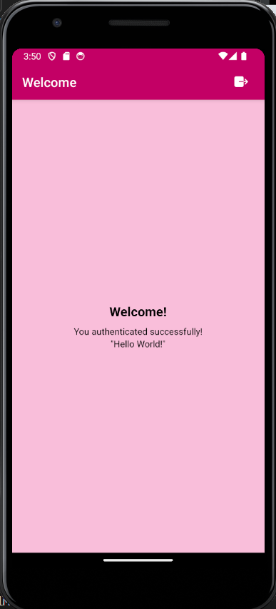

# Authentication App - React Native 

  ## Description

  A simple application implementing authentication on a React Native application.  After signup or login, an authenticated user will see a welcome screen.

  ### Login Screen:

  

  ### Signup Screen:

  

  ### Welcome Screen
  
  
  ## Table of Contents
  
  - [Installation](#installation)
  - [Usage](#usage)
  - [License](#license)
  - [Contributing](#contributing)
  - [Tests](#tests)
  - [Questions](#questions)
  
  ## Installation
  
  npm install
  
  ## Usage
  Upon opening the app, the user will see the Login screen.  If a new user, click on "create a new user", which will bring up the Signup screen.  The user can then sign up with email and password.  Once authenticated, user will see a Welcome screen.  Logout button is on top right of header.

  ## License
This application is covered under the MIT License.
 For more information: https://opensource.org/licenses/MIT
  
  ## Contributing
  N/A
  
  ## Tests
  N/A

  ## Questions
  Contact Info 
  GitHub user name: BillStephens2022 
  Link to GitHub profile: https://github.com/BillStephens2022 
  Email: stephensbill17@gmail.com
